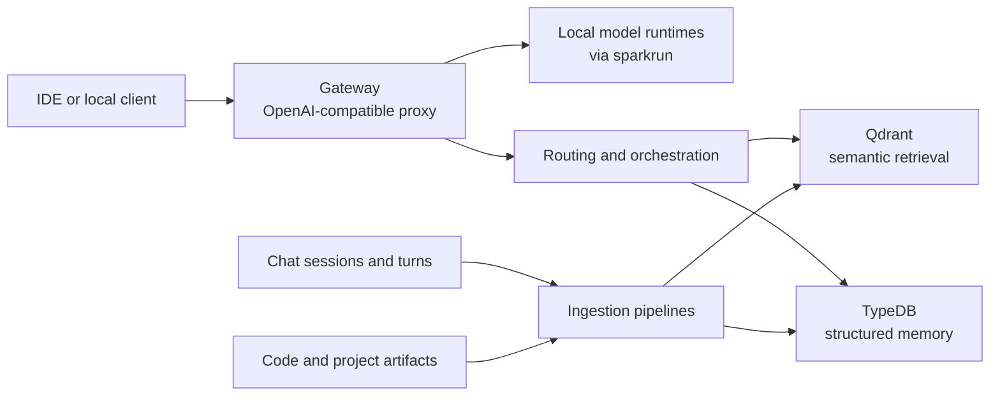

# Kortex Specification

## Purpose

Kortex is a DGX Spark-local developer platform for code assistance, retrieval, and
project memory under tight single-node VRAM constraints.

The system combines:

- A VRAM-aware model gateway that exposes one OpenAI-compatible endpoint while
  starting and stopping local model runtimes on demand.
- A hybrid memory plane that stores both structured facts and semantic vectors.
- Structure-aware ingestion for code, project artifacts, and chat history.
- An optional orchestration layer for routing, retrieval, and background memory
  maintenance.

This document is the architecture source of truth for the repository. Chat logs
and ideation threads are input material, not the spec.

## Product Goals

- Provide a single local endpoint for model access instead of hard-coding model
  ports throughout tools and clients.
- Keep lightweight coding and retrieval capabilities available with low latency.
- Support heavyweight reasoning models on demand without manual operator steps.
- Store codebase knowledge and chat history as durable, queryable project memory.
- Combine symbolic structure and vector retrieval rather than relying on chunked
  text search alone.
- Stay operable on a single DGX Spark before expanding to AI Workbench,
  `nvidia-sync`, or multi-node deployment.

## Non-Goals For The Initial Implementation

- Fully autonomous self-modification of repository instructions or policies.
- Multi-node scheduling or distributed inference beyond what `sparkrun` already
  provides.
- Complete observability, policy inference, or temporal graph reasoning in the
  first milestone.
- Making TypeDB the runtime control plane for everything before the core gateway
  and retrieval loops are stable.

## Constraints

- Primary target: single NVIDIA DGX Spark node.
- Model runtimes are managed externally through `sparkrun` recipes and local
  vLLM-compatible endpoints.
- The system must tolerate cases where only a subset of models can stay online
  concurrently.
- The repository must remain useful even when optional services such as TypeDB,
  Qdrant, or Redis are unavailable during local development.

## Core Architecture

## Component Responsibilities

### 1. Gateway

The gateway is the mandatory front door for model access.

Responsibilities:

- Expose a single OpenAI-compatible API surface.
- Resolve a requested or inferred model to a local runtime.
- Start and stop model processes through `sparkrun`.
- Enforce mutual exclusion for heavyweight models that cannot co-reside.
- Proxy chat, completion, and embedding requests to the active backend.
- Report readiness that reflects both dependency state and backend availability.

Non-responsibilities:

- Long-term memory storage.
- Rich agent planning.
- Complex code ingestion.

### 2. Model Fleet

Kortex treats models as specialized services, not a single monolith.

Target roles:

- Heavy planner: deep reasoning and architecture work.
- Midweight harvester: structured extraction, project analysis, and high-volume
  transformation tasks.
- Coding model: low-latency code editing and assistant tasks.
- Embedding model: semantic indexing for retrieval.

The always-on baseline should be small enough to coexist with the data stack.
Heavier models should be started on demand unless measurement proves otherwise.

### 3. Hybrid Memory Plane

The memory layer has two distinct stores.

TypeDB is the structured source of truth for durable entities and relations.
Qdrant is the semantic recall layer for fuzzy retrieval.

The design assumption is not “TypeDB instead of vectors.” It is “TypeDB for
structure, vectors for recall, and both available to retrieval.”

### 4. Ingestion Pipelines

Kortex needs ingestion for more than code.

Required ingestion domains:

- Source code and repository structure.
- Design docs, notes, and other project artifacts.
- Chat history from coding sessions and planning discussions.

Structure-aware parsing is required for code. AST-backed ingestion should replace
or dominate naive chunking for source files.

## Memory Model

### Code Memory

Code memory should capture:

- Repositories
- Files
- Modules
- Classes
- Functions
- Endpoints
- Imports, calls, ownership, and reference relationships
- Stable source anchors such as repo, path, and line spans

### Chat Memory

Chat history is a first-class memory domain and must be stored in the graph, not
only as embeddings.

Chat memory should capture at least:

- Sessions
- Turns or messages
- Speaker role
- Timestamp
- Message content or durable excerpt
- Mentioned repositories, files, symbols, tools, and models
- Extracted directives or user preferences
- Links from a chat turn to the code entities, artifacts, or rules it discusses

This enables:

- Recalling why a design decision was made.
- Tying a user directive to the code or artifact it affected.
- Compaction that preserves structure instead of flattening everything into a
  summary blob.

### Policy And Preference Memory

Kortex should eventually store durable directives such as coding preferences,
tool-use rules, and architectural constraints as structured graph facts.

However, automatic rewriting of repo instructions is deferred until extraction,
review, and rollback behavior are trustworthy.

## TypeDB Role

TypeDB is an explicit project priority.

Kortex should use TypeDB for:

- Typed entities and relations for code, chat, and project artifacts.
- Durable policy and preference storage.
- Multi-hop traversal over project structure and design history.
- Confidence-scored or provenance-aware relationships where useful.

Kortex should not require TypeDB to solve every problem in the first phase.
Retrieval quality and ingestion correctness matter more than prematurely adding
complex inference behavior.

## Retrieval Strategy

Retrieval should be hybrid by design.

Minimum target behavior:

- Semantic recall from Qdrant for fuzzy matching.
- Structured expansion from TypeDB for neighboring entities and relations.
- Token-bounded context assembly before prompt injection.
- Separate retrieval paths for code, artifacts, and chat history.

The retrieval result should explain not just “what matched” but “why these nodes
belong together.”

## Orchestration

LangGraph or a similar stateful orchestrator is a valid direction, but it is a
second-order layer.

Its future responsibilities should include:

- Task classification and model routing.
- Memory retrieval and context assembly.
- Tool invocation.
- Background compaction and extraction jobs.

The initial repository does not need full metacognitive autonomy to be useful.
It does need a stable gateway plus usable memory primitives.

## Delivery Order

The intended build order is:

1. Stable gateway and model lifecycle control.
2. Stable infrastructure setup and dependency truth.
3. Usable structured plus vector memory foundations.
4. Code ingestion with AST-backed anchors.
5. Chat history ingestion into both graph and vector stores.
6. Retrieval assembly across code, artifacts, and chat.
7. Orchestration and background maintenance loops.
8. Optional observability, AI Workbench packaging, and advanced agent features.

## Near-Term Acceptance Criteria

The repository can be considered aligned with this spec when it satisfies all of
the following:

- One documented gateway endpoint fronts the local model fleet.
- Heavyweight model swaps are deterministic and race-safe.
- TypeDB schema covers code entities and chat-session history, not only code.
- Qdrant indexing exists for both code and chat retrieval.
- Retrieval context is bounded by traversal depth and token budget.
- The README points to stable documentation instead of relying on external chat
  threads.

## Deferred But Recommended

- `typedb-mcp` for structured tool access.
- `ast-grep` or equivalent structural search tooling for ingestion and repair.
- Prometheus and Grafana for infra and model telemetry.
- Langfuse or equivalent trace collection for agent workflows.
- AI Workbench packaging once the runtime behavior is stable.
